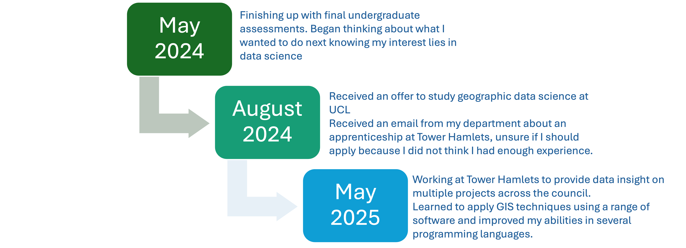
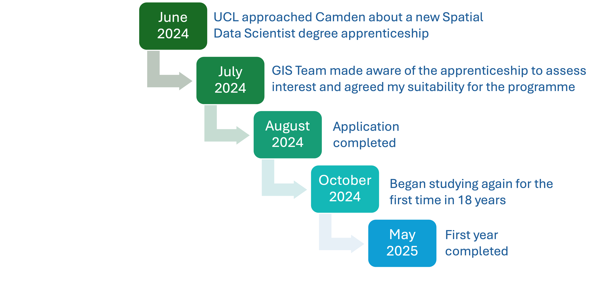

# How we got here 

```{r echo=FALSE, out.width='100%'}

```

---

<div style="height: 70vh; display: flex; align-items: center; justify-content: center; flex-direction: column;">

  <h1 style="margin-bottom: 2vh;">Paul</h1>
  

</div>


---
### We will help you meet these related policies


```{r echo=FALSE}
xaringanExtra::style_panelset_tabs(
  active_foreground = "#3B82F6"
)
```

.panelset.sideways[
.panel[.panel-name[Sustainable Development Goals]
- **SDG 11: Sustainable Cities and Communities**
  - *Target 11.6*: By 2030, reduce the adverse per capita environmental impact of cities, including by paying special attention to air quality and municipal and other waste management.
  - *Indicator 11.6.2*: Annual mean levels of fine particulate matter (e.g., PM₂.₅ and PM₁₀) in cities (population-weighted).
 
- **SDG 3: Good Health and Well-being**
  - *Target 3.9*: By 2030, substantially reduce the number of deaths and illnesses from hazardous chemicals and air, water, and soil pollution and contamination.
  - *Indicator 3.9.1*: Mortality rate attributed to household and ambient air pollution.
]

.panel[.panel-name[London Plan 2021]
- **GG3: Creating a healthy city**
<br><br>
 - *GG3F*: seek to improve London’s air quality, reduce public exposure to poor air quality and minimise inequalities in levels of exposure to air pollution
<br><br>
- **SI1: Improving Air Quality**
<br><br>
  - Identify and deliver further improvements to air quality 
  - Tackle poor air quality and protect health.
    - Development should not:
      - lead to further deterioration of existing poor air quality
      - create any new areas that exceed air quality limits, or delay compliance
      - create unacceptable risk of exposure to poor air quality
]

.panel[.panel-name[World Health Organisation]
```{r echo=FALSE, out.width='100%'}

```
]
]

---
